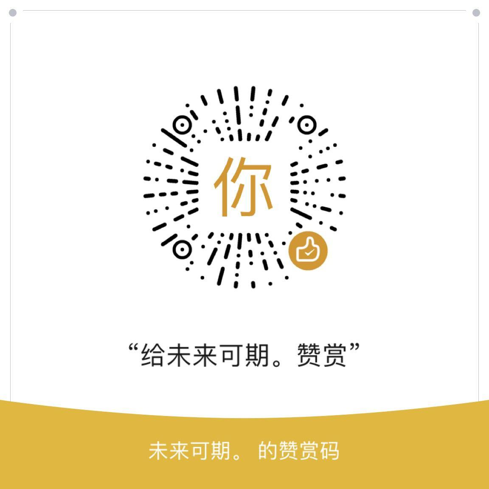

## Script脚本列表

#### 说明

1. 其中 [jd_bean_sign.js](https://raw.githubusercontent.com/LXK9301/jd_scripts/master/jd_bean_sign.js) 可N个京东账号，Node.js专用，核心脚本是JD_DailyBonus.js， IOS软件用户请使用NobyDa的 [JD_DailyBonus.js](https://raw.githubusercontent.com/NobyDa/Script/master/JD-DailyBonus/JD_DailyBonus.js)

2. 以字母排序。

| 活动时长 | 名称                            | 脚本                                                                                                   |
| -------- | --------------------------------- | -------------------------------------------------------------------------------------------------------- |
| 长期   | 京豆变动通知                | [jd_bean_change.js](https://raw.githubusercontent.com/LXK9301/jd_scripts/master/jd_bean_change.js)       |
| 长期   | 领京豆额外奖励&抢京豆   | [jd_bean_home.js](https://raw.githubusercontent.com/LXK9301/jd_scripts/master/jd_bean_home.js)           |
| 长期   | 京东多合一签到             | [jd_bean_sign.js](https://raw.githubusercontent.com/LXK9301/jd_scripts/master/jd_bean_sign.js)           |
| 长期   | 东东超市兑换奖品          | [jd_blueCoin.js](https://raw.githubusercontent.com/LXK9301/jd_scripts/master/jd_blueCoin.js)             |
| 长期   | 口袋书店                      | [jd_bookshop.js](https://raw.githubusercontent.com/LXK9301/jd_scripts/master/jd_bookshop.js)             |
| 长期   | 京东汽车赛点兑换京豆    | [jd_car_exchange.js](https://raw.githubusercontent.com/LXK9301/jd_scripts/master/jd_car_exchange.js)     |
| 长期   | 签到领现金    | [jd_cash.js](https://raw.githubusercontent.com/LXK9301/jd_scripts/master/jd_cash.js)     |
| 长期   | 京东汽车签到                | [jd_car.js](https://raw.githubusercontent.com/LXK9301/jd_scripts/master/jd_car.js)                       |
| 长期   | 摇京豆                         | [jd_club_lottery.js](https://raw.githubusercontent.com/LXK9301/jd_scripts/master/jd_club_lottery.js)     |
| 长期   | 疯狂的JOY挂机                | [jd_crazy_joy_coin.js](https://raw.githubusercontent.com/LXK9301/jd_scripts/master/jd_crazy_joy_coin.js) |
| 长期   | 疯狂的JOY日常任务          | [jd_crazy_joy.js](https://raw.githubusercontent.com/LXK9301/jd_scripts/master/jd_crazy_joy.js)           |
| 长期   | 京东金融-天天提鹅         | [jd_daily_egg.js](https://raw.githubusercontent.com/LXK9301/jd_scripts/master/jd_daily_egg.js)           |
| 长期   | 京喜工厂                      | [jd_dreamFactory.js](https://raw.githubusercontent.com/LXK9301/jd_scripts/master/jd_dreamFactory.js)     |
| 长期   | 东东农场                      | [jd_fruit.js](https://raw.githubusercontent.com/LXK9301/jd_scripts/master/jd_fruit.js)                   |
| 长期   | 宠汪汪                         | [jd_joy.js](https://raw.githubusercontent.com/LXK9301/jd_scripts/master/jd_joy.js)                       |
| 长期   | 获取所有互助码             | [jd_get_share_code.js](https://raw.githubusercontent.com/LXK9301/jd_scripts/master/jd_get_share_code.js) |
| 长期   | 东东工厂                      | [jd_jdfactory.js](https://raw.githubusercontent.com/LXK9301/jd_scripts/master/jd_jdfactory.js)           |
| 长期   | 京东赚赚                      | [jd_jdzz.js](https://raw.githubusercontent.com/LXK9301/jd_scripts/master/jd_jdzz.js)                     |
| 长期   | 宠汪汪单独喂食             | [jd_joy_feedPets.js](https://raw.githubusercontent.com/LXK9301/jd_scripts/master/jd_joy_feedPets.js)     |
| 长期   | 宠汪汪强制为好友助力（iOS端专用） | [bk_jd_joy_help.js](https://raw.githubusercontent.com/LXK9301/jd_scripts/master/jd_joy_help.js)             |
| 长期   | 宠汪汪聚宝盆辅助脚本（iOS端专用） | [jd_petTreasureBox.js](https://raw.githubusercontent.com/LXK9301/jd_scripts/master/jd_petTreasureBox.js) |
| 长期   | 宠汪汪兑换奖品             | [jd_joy_reward.js](https://raw.githubusercontent.com/LXK9301/jd_scripts/master/jd_joy_reward.js)         |
| 长期   | 宠汪汪赛跑助力             | [jd_joy_run.js](https://raw.githubusercontent.com/LXK9301/jd_scripts/master/jd_joy_run.js)               |
| 长期   | 宠汪汪偷好友狗粮与积分 | [jd_joy_steal.js](https://raw.githubusercontent.com/LXK9301/jd_scripts/master/jd_joy_steal.js)           |
| 长期   | 宠汪汪                         | [jd_joy.js](https://raw.githubusercontent.com/LXK9301/jd_scripts/master/jd_joy.js)                       |
| 长期   | 京喜农场                      | [jd_jxnc.js](https://raw.githubusercontent.com/LXK9301/jd_scripts/master/jd_jxnc.js)                     |
| 长期   | 京东快递签到                | [jd_kd.js](https://raw.githubusercontent.com/LXK9301/jd_scripts/master/jd_kd.js)                         |
| 长期   | 京东直播                      | [jd_live.js](https://raw.githubusercontent.com/LXK9301/jd_scripts/master/jd_live.js)                     |
| 长期   | 京东抽奖机                   | [jd_lotteryMachine.js](https://raw.githubusercontent.com/LXK9301/jd_scripts/master/jd_lotteryMachine.js) |
| 长期   | 摇钱树                         | [jd_moneyTree.js](https://raw.githubusercontent.com/LXK9301/jd_scripts/master/jd_moneyTree.js)           |
| 长期   | 点点券                         | [jd_necklace.js](https://raw.githubusercontent.com/LXK9301/jd_scripts/master/jd_necklace.js)             |
| 长期   | 东东萌宠                      | [jd_pet.js](https://raw.githubusercontent.com/LXK9301/jd_scripts/master/jd_pet.js)                       |
| 长期   | 金融养猪                      | [jd_pigPet.js](https://raw.githubusercontent.com/LXK9301/jd_scripts/master/jd_pigPet.js)                 |
| 长期   | 种豆得豆                      | [jd_plantBean.js](https://raw.githubusercontent.com/LXK9301/jd_scripts/master/jd_plantBean.js)           |
| 长期   | 京东排行榜签到得京豆    | [jd_rankingList.js](https://raw.githubusercontent.com/LXK9301/jd_scripts/master/jd_rankingList.js)       |
| 长期   | 全民开红包                   | [jd_redPacket.js](https://raw.githubusercontent.com/LXK9301/jd_scripts/master/jd_redPacket.js)           |
| 长期   | 进店领豆                      | [jd_shop.js](https://raw.githubusercontent.com/LXK9301/jd_scripts/master/jd_shop.js)                     |
| 长期   | 东东小窝                      | [jd_small_home.js](https://raw.githubusercontent.com/LXK9301/jd_scripts/master/jd_small_home.js)         |
| 长期   | 天天加速                      | [jd_speed.js](https://raw.githubusercontent.com/LXK9301/jd_scripts/master/jd_speed.js)                   |
| 长期   | 东东超市                      | [jd_superMarket.js](https://raw.githubusercontent.com/LXK9301/jd_scripts/master/jd_superMarket.js)       |
| 长期   | 十元街                         | [jd_syj.js](https://raw.githubusercontent.com/LXK9301/jd_scripts/master/jd_syj.js)                       |
| 长期   | 注销京东会员卡             | [jd_unbind.js](https://raw.githubusercontent.com/LXK9301/jd_scripts/master/jd_unbind.js)                 |
| 长期   | 取关京东店铺和商品       | [jd_unsubscribe.js](https://raw.githubusercontent.com/LXK9301/jd_scripts/master/jd_unsubscribe.js)       |
| 长期   | 京喜签到       | [jx_sign.js](https://raw.githubusercontent.com/LXK9301/jd_scripts/master/jx_sign.js)       |

搬运脚本
1.  【[@yangtingxiao](https://github.com/yangtingxiao)】京东抽奖机([jd_lotteryMachine.js](https://raw.githubusercontent.com/LXK9301/jd_scripts/master/jd_lotteryMachine.js))

2.  【[@yangtingxiao](https://github.com/yangtingxiao)】京东排行榜([jd_rankingList.js](https://raw.githubusercontent.com/LXK9301/jd_scripts/master/jd_rankingList.js))

**脚本兼容: [QuantumultX](https://apps.apple.com/us/app/quantumult-x/id1443988620), [Surge](https://apps.apple.com/us/app/surge-4/id1442620678), [Loon](https://apps.apple.com/us/app/loon/id1373567447), 小火箭, JSBox, Node.js**

**TODO**

- [x] 所有活动互助码在一个脚本打印

## 邀请码互助

- [邀请码互助入口](https://github.com/LXK9301/jd_scripts/discussions)

- [获取各类活动互助码脚本 jd_get_share_code.js](https://raw.githubusercontent.com/LXK9301/jd_scripts/master/jd_get_share_code.js)

- [邀请码使用规范](githubAction.md#互助码类环境变量)(仅限云端)

## 食用方法

### 1. Docker1

- [部署方法](https://github.com/LXK9301/jd_scripts/tree/master/docker)

- [环境变量集合](https://github.com/LXK9301/jd_scripts/blob/master/githubAction.md)
 
- 获取京东cookie教程可参考：
  
  + [浏览器获取京东cookie教程](https://github.com/LXK9301/jd_scripts/blob/master/backUp/GetJdCookie.md)
    
  + [插件获取京东cookie教程](https://github.com/LXK9301/jd_scripts/blob/master/backUp/GetJdCookie2.md)
    
  + 京东APP扫码获取cookie(此种方式获取的cookie有效期为90天)(执行`node getJDCookie.js`即可)

### 2. Docker2

教程请见：[EvineDeng/jd-base](https://github.com/EvineDeng/jd-base)

### 3. 系统直装

教程请见：[EvineDeng/jd-base](https://github.com/EvineDeng/jd-base)，适用于以下系统：

  1. Armbian/OpenWrt/Debian/Ubuntu/CentOS/Fedora/RedHat等Linux系统

  2. Android

  3. MacOS

### 4. iOS代理软件（QuantumultX, Surge, Loon, 小火箭）

##### 获取京东cookie
- [京东cookie获取脚本 JD_extra_cookie.js](https://raw.githubusercontent.com/LXK9301/jd_scripts/master/JD_extra_cookie.js)

##### 订阅链接：
- Surge：Task&Cookies脚本模块地址: https://raw.githubusercontent.com/LXK9301/jd_scripts/master/Surge/lxk0301_Task.sgmodule.sgmodule

- Loon：Task&Cookies脚本订阅链接: https://raw.githubusercontent.com/LXK9301/jd_scripts/master/Loon/lxk0301_LoonTask.conf

- QuantumultX Task脚本订阅链接: https://raw.githubusercontent.com/LXK9301/jd_scripts/master/QuantumultX/lxk0301_gallery.json

- QuantumultX cookie脚本订阅链接: https://raw.githubusercontent.com/LXK9301/jd_scripts/master/QuantumultX/lxk0301_cookies.conf
## 赞赏码(开发维护不易,请赏杯茶水费)

## 特别感谢(排名不分先后)：

* [@NobyDa](https://github.com/NobyDa)

* [@chavyleung](https://github.com/chavyleung)

* [@liuxiaoyucc](https://github.com/liuxiaoyucc)

* [@Zero-S1](https://github.com/Zero-S1)

* [@uniqueque](https://github.com/uniqueque)

* [@nzw9314](https://github.com/nzw9314)
